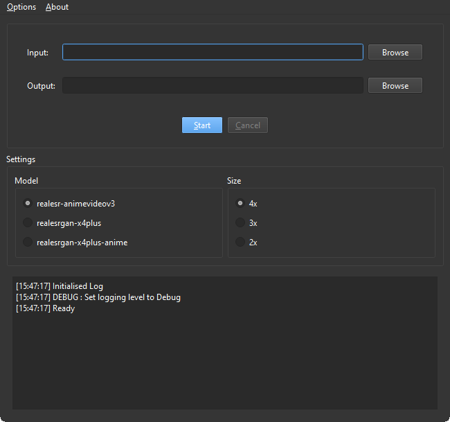

# Real-ESRGAN-ncnn-Vulkan-UI

Qt6 frontend for the [Real-ESRGAN-ncnn-vulkan](https://github.com/xinntao/Real-ESRGAN-ncnn-vulkan) command line utility.

## Installing
Currently requires you to manually download a release of Real-ESRGAN-ncnn-vulkan along with the built models.  
Extracting them next to the executable in a folder called `cli/` allows the frontend to use them.

Eventually the plan is to provide functionality for fetching the files automatically